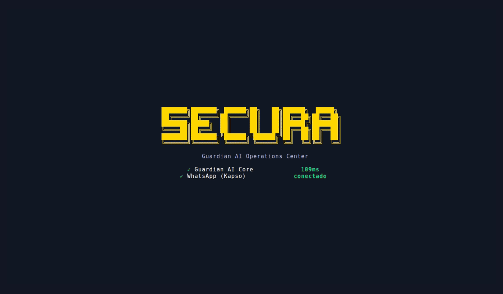
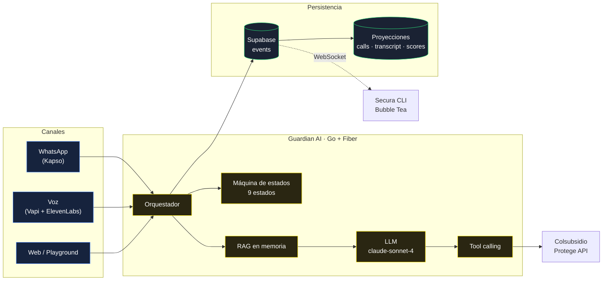
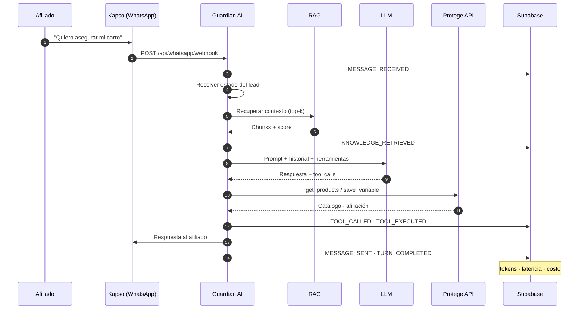
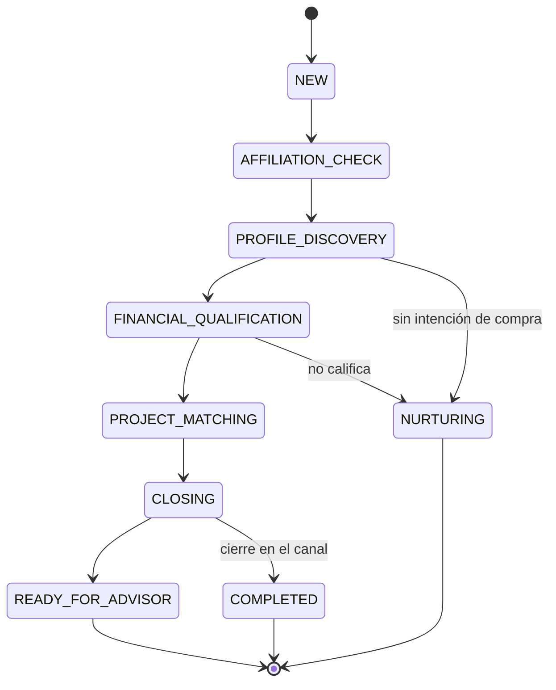

<div align="center">

# Secura

**Donde comienza una conversación, comienza la protección.**

Asesor de seguros conversacional para Colsubsidio. Atiende por WhatsApp y por voz,
califica al afiliado contra la API real de Colsubsidio Protege y entrega al asesor
humano un lead con contexto completo — no una transcripción.

[](https://go.dev)
[](https://gofiber.io)
[](https://react.dev)
[](https://github.com/charmbracelet/bubbletea)
[](LICENSE)

[Landing](https://teamflashackaton30x.com) ·
[Probar la CLI en el navegador](https://teamflashackaton30x.com/probar) ·
[Arquitectura](docs/architecture/README.md) ·
[API](docs/api/README.md) ·
[ADRs](docs/adr/README.md)

</div>

---

## El problema

Un afiliado de Colsubsidio pregunta por un seguro un sábado a las 11 de la noche.
Nadie contesta. El lunes ya compró en otro lado, o simplemente se le olvidó.

Cuando sí hay un asesor disponible, gasta los primeros diez minutos en preguntas
que el sistema ya podría responder: si está afiliado, en qué categoría, qué
productos le aplican, cuánto puede pagar.

## Qué hace Secura

Sostiene la conversación completa —por WhatsApp o por teléfono— y solo escala a
un humano cuando el lead ya está calificado. El asesor recibe el perfil, las
variables capturadas, la recomendación y el motivo de cada decisión.

Todo lo que el sistema hace queda como **evento inmutable** en Supabase: cada
llamada al modelo, cada herramienta ejecutada, cada cambio de estado, con sus
tokens, su latencia y su costo. Eso es lo que hace auditable a un agente de IA
que habla con clientes reales.

## Demo

La CLI opera el sistema completo desde la terminal. Lo que se ve aquí corrió
contra el backend real:



> Pruébala tú mismo sin instalar nada: **[teamflashackaton30x.com/probar](https://teamflashackaton30x.com/probar)**

---

## Arquitectura



El detalle completo —event sourcing, proyecciones, reconexión, tolerancia a
fallos— está en **[docs/architecture](docs/architecture/README.md)**.

### El ciclo de una conversación



### Estados del lead

Los nueve estados son reales y viven en
[`statemachine.go`](guardian-ai/backend/statemachine.go). El pipeline de la CLI
no inventa una animación: renderiza estas transiciones conforme llegan.



---

## Stack

Verificado contra `go.mod` y `package.json` — sin dependencias decorativas.

| Capa | Tecnología | Por qué |
|---|---|---|
| Backend | **Go 1.22** + Fiber v2.52 | Un binario, sin runtime. WebSocket nativo para el stream de eventos |
| Persistencia | **Supabase** (Postgres) vía `pgx/v5` | Event store append-only + proyecciones. Sin ORM, sin SDK: SQL directo |
| LLM | **OpenRouter** → `anthropic/claude-sonnet-4` | Cambiar de modelo es una variable de entorno, no un refactor |
| RAG | Corpus `.md` local + `text-embedding-3-small` **en memoria** | Ver [ADR-0003](docs/adr/0003-rag-en-memoria.md): 5 documentos no justifican una base vectorial |
| WhatsApp | **Kapso** Business API | Webhook entrante, sesiones persistidas por teléfono |
| Voz | **Vapi** + **ElevenLabs** | Ingesta de transcripción al mismo pipeline de eventos |
| CLI | **Go** + Bubble Tea v1.3 + Lip Gloss | Centro de operaciones en terminal, 8 módulos |
| Landing | **React 19** + Vite + Tailwind v4 | Cloudflare Pages |

El backend tiene **4 dependencias directas**. Esa cifra es una decisión, no un
accidente.

---

## Quick Start

Requisitos: Docker y Docker Compose. Nada más.

```bash
git clone https://github.com/FilipaoVfx/hackatonv2Colsubsidio.git
cd hackatonv2Colsubsidio
cp .env.example .env      # rellena las claves — ver docs/reference/env.md
make dev
```

En cuatro minutos tienes el sistema en `http://localhost:8099`. Verifícalo:

```bash
make health
```

Debe responder las 7 capabilities en verde. Si alguna sale en rojo, la variable
de entorno correspondiente falta — no es un fallo de código.

<details>
<summary><b>Sin Docker (Go 1.22+ nativo)</b></summary>

```bash
cd guardian-ai/backend
cp ../.env.example .env && set -a && source .env && set +a
go run .          # escucha en :3000
```

</details>

### Probar la CLI

```bash
# Sin instalar nada — corre en el navegador contra el sistema real
open https://teamflashackaton30x.com/probar

# En Windows, local
irm https://teamflashackaton30x.com/install.ps1 | iex

# Desde el código
cd guardian-ai/cli && go run . --api-url http://localhost:8099
```

### Disparar una conversación real

```bash
curl -X POST localhost:8099/api/whatsapp/simulate-inbound \
  -H 'Content-Type: application/json' \
  -d '{"from":"573001234567","text":"quiero asegurar mi carro"}'
```

Recorre el sistema entero: LLM real, RAG real, herramientas reales, persistencia
real. Míralo en vivo con `secura tail` o en la pestaña Pipeline de la CLI.

---

## Estructura

```
.
├── guardian-ai/
│   ├── backend/          Go + Fiber · orquestador, RAG, event store  → README
│   ├── cli/              Secura CLI · Bubble Tea, 8 módulos          → README
│   ├── frontend/         Dashboard estático servido por nginx
│   ├── mock-protege/     Mock de la Colsubsidio Protege API
│   └── nginx/            Reverse proxy · expone :8099
├── docs/
│   ├── architecture/     Event sourcing, proyecciones, diagramas
│   ├── adr/              Decisiones y sus consecuencias
│   ├── api/              33 endpoints con curl de ejemplo
│   ├── specs/            PRD, SRS y specs de features
│   └── reference/        API de Colsubsidio, runbooks, variables
└── assets/               Marca y muestras de datos
```

## Documentación

| Documento | Para qué |
|---|---|
| [Arquitectura](docs/architecture/README.md) | Cómo funciona por dentro, con diagramas |
| [API](docs/api/README.md) | Los 33 endpoints, request/response, errores |
| [LLM](docs/llm.md) | Modelo, prompts, memoria, tool calling, fallback |
| [RAG](docs/rag.md) | Chunking, embeddings, recuperación, degradación |
| [Seguridad](docs/security.md) | Secretos, webhooks, prompt injection, escrituras |
| [Observabilidad](docs/observability.md) | Eventos como telemetría, KPIs, procedencia |
| [Testing](docs/testing.md) | 22 suites, qué cubren y qué no |
| [Despliegue](docs/deployment.md) | Docker, túneles, Cloudflare Pages |
| [ADRs](docs/adr/README.md) | Por qué se decidió cada cosa |
| [Contribuir](CONTRIBUTING.md) | Levantar, commits, PRs |

## Roadmap

Ver [ROADMAP.md](ROADMAP.md). Resumen: v1 hackathon (hecho) → v2 panel de asesor
→ v3 voz en producción → v4 analítica → v5 marketplace de agentes.

## Licencia

[MIT](LICENSE).

---

<div align="center">
<sub>Reto 03 · Colsubsidio · Hackathon 30X</sub>
</div>
