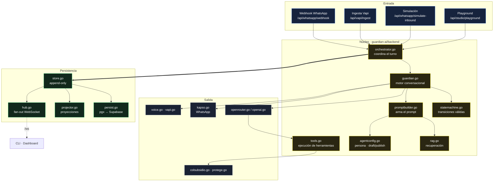
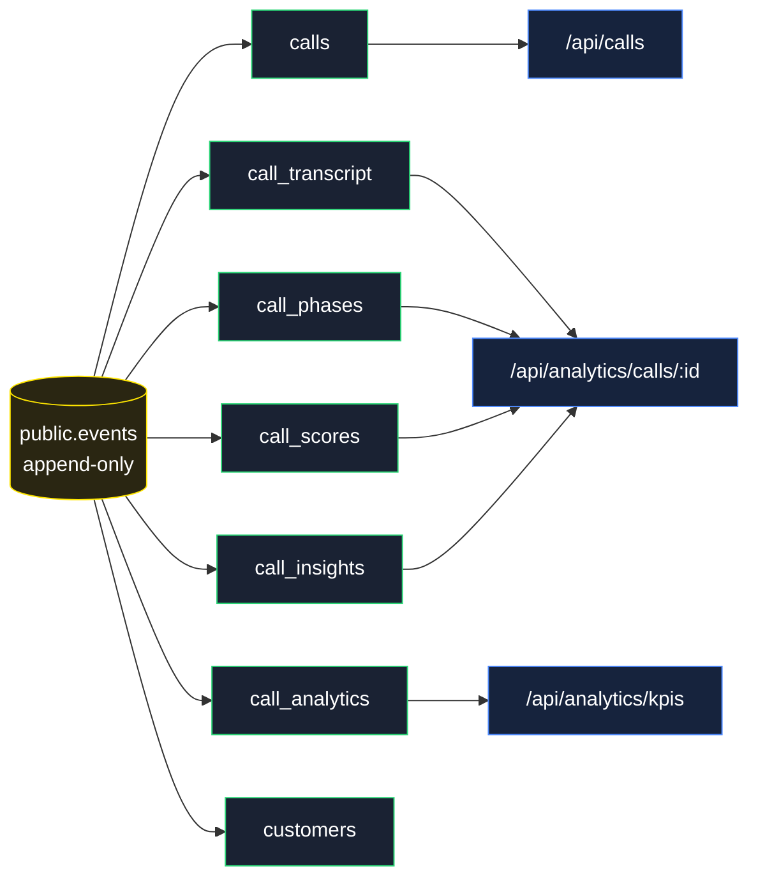
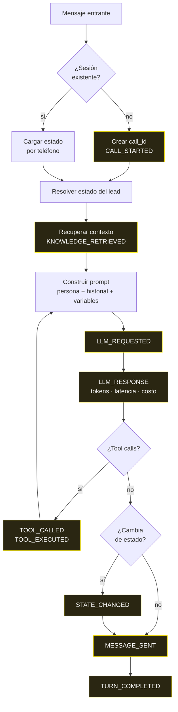

# Arquitectura

> Un monolito Go event-sourced. La decisión central del proyecto es que **nada
> muta estado directamente**: todo pasa por un evento inmutable, y las vistas
> que consume la interfaz son proyecciones derivadas de ese log.

## Por qué event sourcing

Un agente de IA que habla con clientes reales tiene que poder responder tres
preguntas después del hecho: qué le dijo al cliente, por qué lo dijo, y cuánto
costó. Con un modelo CRUD clásico —una tabla `conversations` que se sobrescribe—
ninguna de las tres tiene respuesta.

El log de eventos las responde todas sin instrumentación extra. La misma
estructura que persiste el estado alimenta el dashboard en vivo, el replay de
una llamada y la analítica de costos. Ver [ADR-0001](../adr/0001-event-sourcing.md).

## Vista general



Las flechas gruesas (`==>`) marcan el camino obligatorio: **todo turno termina
en el store**. No hay ruta que escriba estado saltándose el log.

## El envelope de evento

Definido en [`events.go`](../../guardian-ai/backend/events.go). Siete campos,
estables desde el primer commit:

```go
type Event struct {
    EventID   string                 `json:"event_id"`
    Type      string                 `json:"type"`
    CallID    string                 `json:"call_id"`
    Sequence  int                    `json:"sequence"`   // monótono por call_id
    Timestamp string                 `json:"timestamp"`
    Producer  string                 `json:"producer"`
    Payload   map[string]interface{} `json:"payload"`
}
```

`Sequence` monótono por `call_id` es lo que hace detectable un hueco: si un
consumidor recibe 7 después de 5, sabe que perdió el 6 y puede rehidratar por
REST sin adivinar. La CLI usa exactamente eso.

Los 22 tipos de evento y su payload están en
[event-catalog.md](event-catalog.md).

## De eventos a vistas



[`projector.go`](../../guardian-ai/backend/projector.go) (884 líneas, la pieza
más grande del backend) traduce cada tipo de evento a escrituras sobre estas
tablas. Es idempotente por `event_id`: reproyectar el log completo produce el
mismo resultado.

**Consecuencia práctica:** una llamada recién creada tiene eventos pero todavía
no tiene fila en `call_analytics`. El consumidor debe tratar ese 404 como
estado normal, no como error — la CLI lo hace separando el error de detalle del
error de eventos.

## Turno conversacional



El bucle `TOOL_EXECUTED → PROMPT` es el que permite que el modelo consulte la
API de Colsubsidio, reciba el catálogo real y recién entonces responda. Sin ese
ciclo, el agente inventaría productos.

## Streaming en vivo

[`hub.go`](../../guardian-ai/backend/hub.go) es un fan-out sin persistencia: 48
líneas. Cada evento que entra al store se emite a todos los suscriptores de
`/ws`. Los clientes que se conectan tarde no reciben historial por el socket —
lo piden por `GET /api/calls/:id/events`.

Esa separación (socket para lo vivo, REST para lo histórico) es deliberada:
evita que el hub tenga que mantener buffers por cliente y hace trivial la
reconexión.

## Tolerancia a fallos

| Falla | Comportamiento |
|---|---|
| Supabase caído | El sistema **sigue conversando**. `persist.go` degrada a memoria; los eventos se pierden al reiniciar, la conversación no |
| Sin `OPENAI_API_KEY` | RAG cae a modo keyword (ver [rag.md](../rag.md)); el LLM no arranca |
| Sin Kapso | El canal WhatsApp corre en modo simulación por `/api/whatsapp/simulate-inbound` |
| Protege API caída | El motor cae al fallback GPT libre (`GUARDIAN_DISABLED`) |
| WebSocket cortado | El cliente rehidrata por REST usando `Sequence` para detectar el hueco |

El principio: **cada dependencia externa tiene un modo degradado explícito**, y
`/api/capabilities` dice cuál está activo. Nada falla en silencio.

## Qué NO es esta arquitectura

Honestidad sobre los límites, porque un jurado técnico los va a encontrar:

- **No es CQRS distribuido.** Un proceso, una base. Las proyecciones corren en
  el mismo binario, sincrónicamente.
- **No hay workers ni colas.** Un turno se procesa en el request. Con la
  latencia real del LLM (~1.5 s) alcanza; con volumen de producción no.
- **No hay multi-tenancy.** Una instancia, una marca.
- **El RAG es en memoria.** Ver [ADR-0003](../adr/0003-rag-en-memoria.md): con 5
  documentos es la decisión correcta; con 5.000 no lo sería.

## Ver también

- [API](../api/README.md) — los 33 endpoints
- [Catálogo de eventos](event-catalog.md) — los 22 tipos y sus payloads
- [ADRs](../adr/README.md) — por qué cada decisión
