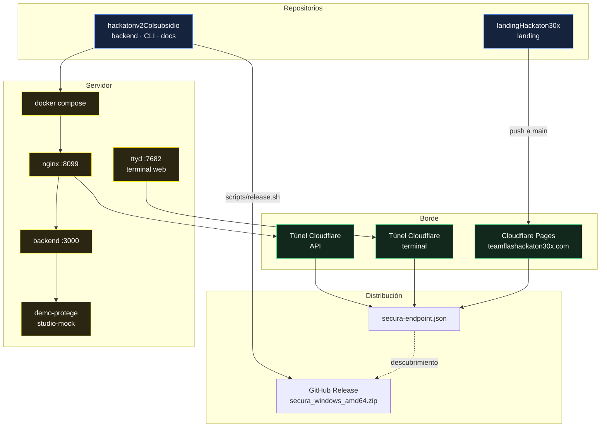

# Despliegue

Tres piezas se despliegan por caminos distintos: el backend por Docker en un
servidor, la landing por Cloudflare Pages, y la CLI por GitHub Releases.



## Backend

```bash
cp .env.example .env    # rellenar claves
make dev                # docker compose up -d --build
make health             # verificar las 7 capabilities
```

Servicios que levanta `docker-compose.yml`:

| Servicio | Puerto host | Rol |
|---|---|---|
| `nginx` | **8099** | Único puerto expuesto; proxy al backend y sirve el frontend estático |
| `backend` | — | Solo red interna |
| `demo-protege` | 9002 | Mock de Protege para el canal WhatsApp |
| `studio-mock` | — | Mock **dedicado** al Playground, aislado del de producción |
| `mock-protege` | 9001 | Perfil `mock`, solo desarrollo offline |

El volumen `guardian-config` persiste la configuración del Agent Studio entre
recreaciones. Borrarlo pierde las versiones publicadas.

## El dominio como punto de indirección

El backend vive detrás de un **quick tunnel de Cloudflare**, cuyo hostname
cambia en cada reinicio. Nada que toque el jurado puede contener esa URL.

La solución es una indirección: `teamflashackaton30x.com` —estable, Cloudflare
Pages— publica el archivo que dice dónde está todo hoy.

```json
{
  "api_url": "https://<quick-tunnel>.trycloudflare.com",
  "web_terminal": "https://<quick-tunnel>.trycloudflare.com",
  "updated": "2026-07-26T17:49:29Z"
}
```

La CLI lo resuelve al arrancar cuando no se le pasa `--api-url`
([`discover.go`](../guardian-ai/cli/internal/api/discover.go)). Precedencia:

```
--api-url  >  SECURA_API_URL  >  descubrimiento  >  localhost:8099
```

**Rotar un túnel cuesta un comando:**

```bash
./guardian-ai/cli/scripts/tunnels.sh
```

Levanta ambos túneles, los verifica, reescribe `secura-endpoint.json` en el repo
de la landing y hace push. Pages redespliega en ~40 s. No se recompila nada, y
los binarios ya instalados vuelven a conectar solos.

## Terminal web

`ttyd` sirve la TUI por navegador. Un proceso por cliente, y el comando es el
binario directo — **nunca un shell**, así que no hay escape a bash.

```bash
pm2 start guardian-ai/cli/scripts/web-terminal.sh --name secura-ttyd
```

Corre siempre con `--read-only`: la sesión es pública y los módulos Settings y
Prompt escriben en producción. Ver [seguridad](security.md).

## Landing

Cloudflare Pages con integración nativa de Git: cada push a `main` en
`landingHackaton30x` construye y despliega.

> **Aviso:** el repo tiene además un workflow de GitHub Actions
> (`deploy.yml`) que **falla en cada push** porque le falta el secret
> `CLOUDFLARE_API_TOKEN`. Los despliegues reales los hace la integración nativa;
> la Action solo produce ruido roja. Hay que ponerle el token o borrarla.

Archivos estáticos servidos desde `public/`:

| Archivo | Para qué |
|---|---|
| `install.ps1` | Instalador de Windows |
| `secura-endpoint.json` | Descubrimiento |
| `probar.html` | Redirige al terminal web leyendo el JSON |
| `_headers` | Fuerza `text/plain` en `.ps1` y `no-store` en el JSON |

`_headers` y `_redirects` **deben vivir en `public/`**, no en la raíz: Vite solo
copia `public/` a `dist/`. Estuvieron en la raíz un tiempo y por eso las
cabeceras de seguridad nunca se aplicaron.

## CLI

```bash
./guardian-ai/cli/scripts/release.sh v0.1.0
```

Compila `windows/amd64` (cero cgo, cross-compile puro), empaqueta, genera
`checksums.txt` y publica con `gh release create`.

Solo Windows: el resto de plataformas entra por el terminal web, que no depende
del sistema operativo.

## Verificación tras desplegar

```bash
make health                                              # capabilities
curl -sI https://teamflashackaton30x.com/install.ps1     # → text/plain
curl -s  https://teamflashackaton30x.com/secura-endpoint.json
secura doctor                                            # descubrimiento extremo a extremo
```

## Ver también

- [Seguridad](security.md) · [Arquitectura](architecture/README.md)
