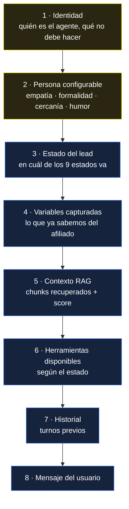
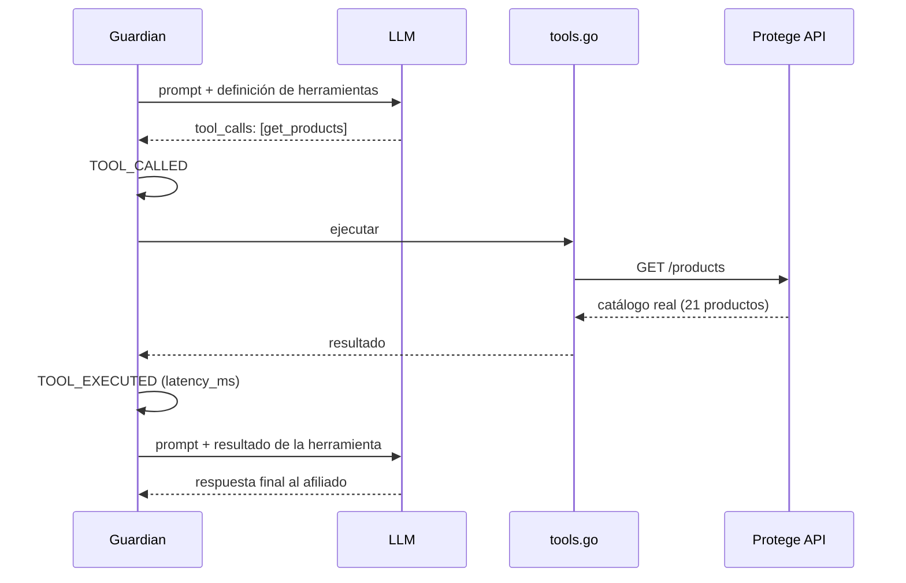

# LLM

## Modelos

| Rol | Modelo | Dónde | Archivo |
|---|---|---|---|
| Conversación | `anthropic/claude-sonnet-4` | OpenRouter |  [`openai.go`](../guardian-ai/backend/openai.go) |
| Fallback | `openai/gpt-4o` | OpenAI directo |  [`openai.go`](../guardian-ai/backend/openai.go) |
| Embeddings | `text-embedding-3-small` | OpenAI | [`rag.go`](../guardian-ai/backend/rag.go) |

OpenRouter como gateway significa que cambiar de modelo es una variable de
entorno, no un refactor. Ver [ADR-0004](adr/0004-openrouter-gateway.md).

## Jerarquía del prompt

[`promptbuilder.go`](../guardian-ai/backend/promptbuilder.go) arma cada llamada
por capas. El orden importa: lo estable arriba, lo volátil abajo.

Las capas 1–2 son idénticas entre turnos y se benefician del caché de prompt.
Las 3–8 cambian, y por eso van al final.

### Persona configurable

Las perillas de la capa 2 viven en
[`agentconfig.go`](../guardian-ai/backend/agentconfig.go) y son editables en
caliente por el Agent Studio:

`empathy` · `formality` · `closeness` · `persuasion` · `proactivity` ·
`emojis` · `humor` · `safety_level`

No son texto libre: son enteros que el builder traduce a instrucciones. Eso hace
que un cambio de tono sea versionable y reversible, en vez de una edición de
prompt que nadie recuerda haber hecho.

## Tool calling

El modelo no inventa datos de producto. Cuando necesita información real, llama
una herramienta y espera el resultado antes de responder.

Herramientas definidas en [`tools.go`](../guardian-ai/backend/tools.go):
consulta de afiliación, catálogo de productos, guardado de variables,
recuperación de variables, cotización y matrícula.

**La disponibilidad depende del estado.** En `AFFILIATION_CHECK` el modelo no
tiene acceso a `create_enrollment`. Cerrar una venta antes de validar quién es
el cliente no es un error de prompt que haya que pedirle al modelo evitar: es
una herramienta que sencillamente no está en la mesa.

## Memoria

No hay vector store de conversaciones ni resumen automático. La memoria es:

1. **Variables estructuradas** — [`memory.go`](../guardian-ai/backend/memory.go).
   Lo que el agente aprendió del afiliado, como pares clave/valor persistidos.
   Sobreviven entre sesiones porque se guardan contra el teléfono.
2. **Historial de turnos** — los mensajes previos de la conversación actual.
3. **Estado del lead** — un solo enum que resume en qué punto del embudo va.

Esa combinación es deliberada: un resumen generado por el modelo puede alucinar;
una variable capturada explícitamente por una herramienta, no.

## Costo y latencia

Cada `LLM_RESPONSE` lleva `tokens_in`, `tokens_out`, `cost_usd` y `latency_ms`
en el payload. No se estiman: vienen de la respuesta del proveedor.

Números medidos sobre el tráfico real del hackathon:

| Métrica | Valor |
|---|---|
| Latencia media | ~1.440 ms |
| Tokens acumulados | 452.298 in / 14.772 out |
| Costo acumulado | $1,29 USD |
| Costo por conversación | ~$0,03 USD |

La asimetría in/out (30:1) es la firma del tool calling: cada ciclo reenvía el
contexto completo más el resultado de la herramienta.

## Degradación

| Falla | Comportamiento |
|---|---|
| Sin `OPENAI_API_KEY` | `/api/health` reporta `llm:false`; el servicio arranca pero no conversa |
| OpenRouter caído | Fallback a OpenAI directo con `gpt-4o` |
| Timeout del modelo | `ERROR_OCCURRED` con reintento; el cliente muestra el estado, no un cuelgue |
| `GUARDIAN_DISABLED=1` | Fuerza el motor de reglas de Protege, sin LLM libre |

## Guardrails

- **Herramientas por estado** (arriba) — la restricción más fuerte, porque es
  estructural y no depende de que el modelo obedezca.
- **`safety_level`** en la persona, versionado como cualquier otro cambio.
- **Sin datos sensibles en el prompt.** El backend nunca inyecta claves ni
  credenciales; las herramientas hablan con la API, el modelo solo ve resultados.
- **Prompt injection**: ver [seguridad](security.md#prompt-injection) para el
  análisis honesto de qué está mitigado y qué no.

## Ver también

- [RAG](rag.md) — cómo se construye la capa 5
- [Prompt engineering](prompt-engineering.md) — plantillas y variables
- [ADR-0004](adr/0004-openrouter-gateway.md)
