# Observabilidad

> No hay Prometheus, ni Grafana, ni OpenTelemetry. **El log de eventos es la
> telemetría.** Cada cosa que un APM registraría por separado —latencia, costo,
> errores, trazas— ya está en el mismo stream que persiste el estado.

## Por qué no hay stack de observabilidad

Un sistema event-sourced ya emite, por construcción, el registro estructurado
que normalmente hay que instrumentar aparte. `LLM_RESPONSE` trae `latency_ms`,
`tokens_in`, `tokens_out` y `cost_usd` en el payload porque los necesita para el
negocio, no porque alguien añadió un `metrics.Observe()`.

Añadir un exportador de métricas duplicaría esa información en un segundo
sistema que puede desincronizarse. Ver [ADR-0001](adr/0001-event-sourcing.md).

## La traza es la secuencia

```mermaid
gantt
  title Un turno, reconstruido desde el log
  dateFormat X
  axisFormat %L ms

  section Entrada
  MESSAGE_RECEIVED       :0, 5
  section Contexto
  KNOWLEDGE_RETRIEVED    :5, 40
  section Modelo
  LLM_REQUESTED          :45, 5
  LLM_RESPONSE           :50, 1440
  section Herramientas
  TOOL_CALLED            :1490, 3
  TOOL_EXECUTED          :1493, 8
  section Salida
  MESSAGE_SENT           :1501, 120
  TURN_COMPLETED         :1621, 2
```



`call_id` es el trace ID. `sequence` es el orden de los spans. No hace falta
propagar contexto entre servicios porque no hay servicios: hay un proceso y un
log ordenado.

## Qué se mide, de verdad

Todo esto sale de `GET /api/analytics/kpis` y **está medido**, no estimado:

| Métrica | Origen | Ejemplo real |
|---|---|---|
| `avg_llm_latency_ms` | `LLM_RESPONSE.latency_ms` | 1.438 ms |
| `cost_usd` | `LLM_RESPONSE.cost_usd` acumulado | $1,29 |
| `tokens_in` / `tokens_out` | Respuesta del proveedor | 452.298 / 14.772 |
| `tool_calls` | Conteo de `TOOL_EXECUTED` | 300 |
| `leads_ready` | Leads en `READY_FOR_ADVISOR` | 21 |
| `leads_whatsapp` | Conversaciones por canal | 39 |
| `variables_captured` | Conteo de `FEATURE_UPDATED` | 254 |

## Procedencia: la regla contra el número inventado

Un dashboard de hackathon miente con facilidad: basta un número bonito sin
fuente. La CLI lo hace **estructuralmente imposible**.

Todo valor que se muestra viaja en un tipo que obliga a declarar de dónde salió
([`prov.go`](../guardian-ai/cli/internal/prov/prov.go)):

```go
type Value[T any] struct {
    V    T
    P    Provenance   // Measured | Derived | Simulated
    Note string
}
```

El widget de KPI **solo acepta `prov.Value`**. Renderizar un número pelado no
compila.

| Insignia | Significado |
|---|---|
| ◆ | Medido — viene de un endpoint o evento |
| ◈ | Derivado — calculado a partir de datos medidos (ej. conversión = `leads_ready / llamadas`) |
| ◇ | Simulado — fixture o replay, siempre atenuado |

`secura provenance --json` lista cada métrica con su origen. Si alguien pregunta
"¿de dónde sale ese 65,6 % de conversión?", la respuesta es un comando, no una
conversación.

## Ver el sistema en vivo

```bash
# Todos los eventos, con formato
secura tail

# Una conversación
secura tail --call <call_id>

# Solo un tipo
secura tail --type LLM_RESPONSE,TOOL_EXECUTED

# Crudo, sin CLI
websocat ws://localhost:8099/ws
```

La TUI (`secura`) da lo mismo con ocho vistas: Dashboard, Conversaciones,
Pipeline, Playground, Prompt, Knowledge, Analytics y Settings.

## Logs

Salida estándar del proceso, formato Go estándar. Sin JSON estructurado, sin
niveles configurables.

```bash
make logs                                   # docker compose logs -f backend
docker compose logs backend | grep "rag:"   # decisiones del RAG al arrancar
```

Los logs cubren arranque y errores de infraestructura. **Todo lo que pasa
durante una conversación está en los eventos**, no en los logs — buscar ahí es
buscar en el sitio equivocado.

## Errores

`ERROR_OCCURRED` entra al mismo log, con `call_id`, así que un fallo queda
correlacionado con la conversación exacta donde ocurrió. La CLI lo pinta en rojo
en el pipeline y ofrece reintento.

No hay agregación de errores tipo Sentry, ni alertas.

## Huecos

- **Sin alertas.** Nadie se entera de que el costo se disparó salvo que mire.
- **Sin retención ni rotación** del log de eventos: `public.events` crece sin
  límite.
- **Sin métricas de infraestructura**: CPU, memoria y conexiones no se observan.
- **Sin SLO ni presupuesto de error.**
- **Sin correlación entre canales**: si un afiliado escribe por WhatsApp y luego
  llama, son dos `call_id` sin vínculo.

## Ver también

- [Catálogo de eventos](architecture/event-catalog.md)
- [Arquitectura](architecture/README.md)
