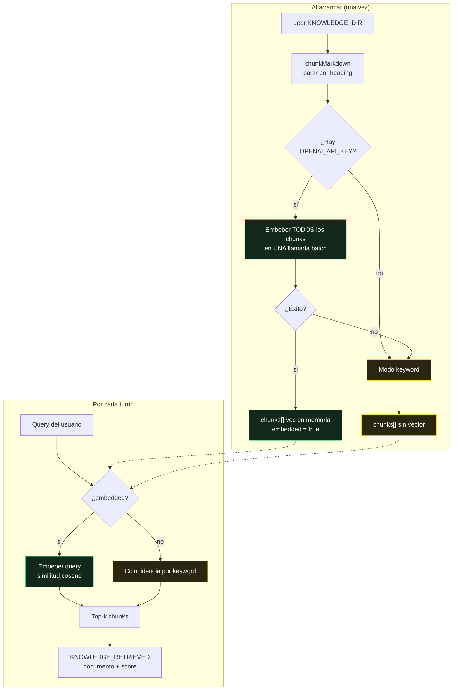

# RAG

> **No hay base de datos vectorial.** El corpus son cinco archivos Markdown, se
> chunkean al arrancar, se embeben en una sola llamada batch y quedan en un
> slice en memoria. La búsqueda es coseno sobre ese slice.
>
> Eso no es un atajo: es la decisión correcta para este tamaño de corpus, y está
> argumentada en [ADR-0003](adr/0003-rag-en-memoria.md).

Implementación completa: [`rag.go`](../guardian-ai/backend/rag.go), 216 líneas.

## El corpus

`guardian-ai/backend/knowledge/` — ubicación configurable con `KNOWLEDGE_DIR`.

| Archivo | Contenido | Líneas |
|---|---|---|
| `faq.md` | Preguntas frecuentes de afiliados | 27 |
| `glosario.md` | Términos de seguros en lenguaje llano | 19 |
| `insights_afiliados.md` | Patrones de comportamiento por segmento | 31 |
| `productos.md` | Portafolio y coberturas | 15 |
| `subsidios.md` | Reglas de subsidio por categoría | 11 |

103 líneas en total. Ese número es el argumento entero contra Pinecone.

## Pipeline



### Chunking

Por **heading de Markdown**. Cada `##` abre un chunk nuevo, arrastrando su
título como metadato.

Elegido sobre el troceado por ventana fija de tokens porque un corpus escrito a
mano ya tiene su unidad semántica marcada: la sección. Partir cada 512 tokens
cortaría una respuesta de FAQ por la mitad, y ningún solapamiento arregla eso
tan bien como respetar el heading que el autor puso a propósito.

### Embeddings

`text-embedding-3-small`, **una sola petición batch** con todos los chunks al
arrancar. Con 103 líneas de corpus el costo es despreciable y la latencia de
arranque, invisible.

No hay persistencia de vectores: reiniciar el proceso recalcula. Con este
tamaño, recalcular es más barato que gestionar un índice, invalidarlo y
mantenerlo coherente.

### Recuperación

Similitud coseno sobre el slice completo. Sin ANN, sin HNSW, sin índice — con
decenas de chunks el escaneo lineal es más rápido que cualquier estructura, y
exacto en vez de aproximado.

El resultado se emite como evento `KNOWLEDGE_RETRIEVED` con documento y score,
así que **qué recuperó el sistema y con cuánta confianza queda auditado** igual
que todo lo demás.

## Degradación a keyword

Si falla la llamada de embeddings —sin clave, sin red, cuota agotada— el
sistema **no cae**: registra `rag: embeddings unavailable (%v) — keyword mode`
y sigue con coincidencia léxica.

`RAG.Mode()` devuelve `"embeddings"` o `"keyword"`, y la CLI lo muestra en el
módulo Knowledge. La calidad baja y se ve que bajó — que es exactamente lo que
debe pasar.

## Actualizar la base de conocimiento

```bash
# 1. Editar o añadir un .md
vim guardian-ai/backend/knowledge/productos.md

# 2. Reiniciar el backend — se re-chunkea y re-embebe al arrancar
make restart

# 3. Verificar
curl -s localhost:8099/api/studio/config | jq '.runtime'
```

No hay comando de reindexado porque no hay índice que mantener. El arranque
*es* el reindexado.

## Límites conocidos

Dicho sin adornos, porque es lo primero que pregunta un jurado técnico:

- **No escala más allá de unos cientos de chunks.** El escaneo lineal por turno
  y el corpus completo en RAM dejan de ser razonables mucho antes de las 10.000
  secciones.
- **Sin versionado del corpus.** Los `.md` viven en git, lo cual es versionado
  suficiente para cinco archivos, pero no hay noción de "qué versión del corpus
  respondió esta conversación".
- **Sin metadatos por chunk** más allá del heading: ni fecha de vigencia, ni
  producto asociado, ni autor.
- **Sin reranking.** Top-k por coseno y ya.

Cuándo cambiaría la decisión, y a qué: en
[ADR-0003](adr/0003-rag-en-memoria.md).

## Ver también

- [LLM](llm.md) — cómo entra el contexto recuperado al prompt
- [ADR-0003](adr/0003-rag-en-memoria.md) — por qué en memoria y no Pinecone
