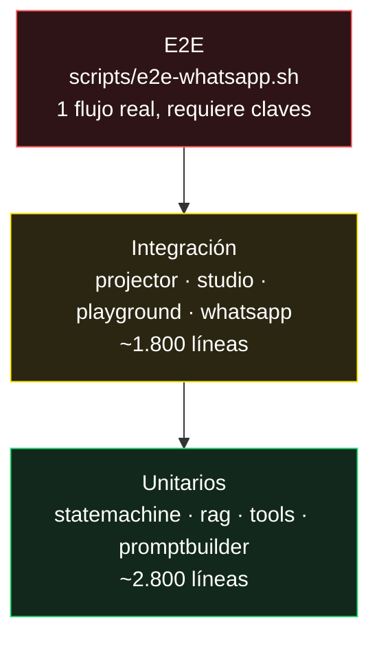

# Testing

```bash
make test        # backend + CLI
```

Estado real: **22 suites, 4.648 líneas de test, en verde.**

```
ok  	guardianai	0.774s
```

Los tests corren **sin red y sin claves**: los clientes de LLM, Protege y Kapso
se sustituyen por dobles. Por eso 4.600 líneas de test tardan menos de un
segundo, y por eso pueden correr en CI sin secretos.

## Qué cubre cada suite

| Suite | Qué verifica | Líneas |
|---|---|---|
| `projector_test.go` | Proyecciones evento → tabla, idempotencia | 584 |
| `guardian_closing_test.go` | Flujo de cierre: cotización y matrícula | 523 |
| `guardian_robustness_test.go` | Entradas raras, mensajes vacíos, orden inesperado | 387 |
| `guardian_test.go` | Motor conversacional, turno completo | 333 |
| `studio_publish_test.go` | Draft → publish → rollback | 213 |
| `guardian_config_test.go` | Persona y perillas de configuración | 211 |
| `promptconfig_test.go` | Construcción del prompt según config | 218 |
| `protege_test.go` | Cliente de la Colsubsidio Protege API | 198 |
| `playground_test.go` | Sesión aislada del Studio | 197 |
| `buttons_test.go` | Botones interactivos de WhatsApp | 179 |
| `whatsapp_test.go` | Webhook, parseo, sesiones | 172 |
| `statemachine_test.go` | Transiciones válidas e inválidas | 170 |
| `studio_test.go` | Endpoints del Agent Studio | 168 |
| `agentconfig_test.go` | Persistencia de configuración | 144 |
| `colsubsidio_variables_test.go` | Mapeo de variables del afiliado | 135 |
| `configstore_test.go` | Versionado de configuración | 130 |
| `openrouter_test.go` | Cliente LLM, parseo de tool calls | 127 |
| `affiliates_test.go` | Lógica de afiliación | 121 |
| `tools_test.go` | Ejecución de herramientas | 91 |
| `promptbuilder_test.go` | Capas del prompt | 71 |
| `rag_test.go` | Chunking y recuperación | 64 |
| `kapso_test.go` | Cliente de WhatsApp | 212 |

En la CLI: `source_readonly_test.go` verifica que **toda** ruta de escritura
está bloqueada bajo `--read-only`. Es el test que protege la sesión pública del
terminal web.

## Pirámide



La base está donde debe estar. La punta es fina a propósito: un E2E que depende
de Kapso, OpenRouter y Supabase a la vez es un test que falla por razones
ajenas al código.

## Correr

```bash
# Todo
make test

# Solo backend
cd guardian-ai/backend && go test ./...

# Una suite, con detalle
go test -run TestStateMachine -v

# Con cobertura
go test -cover ./...

# CLI
cd guardian-ai/cli && go test ./...
```

## E2E manual

[`scripts/e2e-whatsapp.sh`](../guardian-ai/scripts/e2e-whatsapp.sh) recorre el
flujo completo contra un backend vivo. Requiere claves reales y **gasta tokens**.

```bash
make dev
./guardian-ai/scripts/e2e-whatsapp.sh
```

Verificación cruzada rápida sin script:

```bash
curl -X POST localhost:8099/api/whatsapp/simulate-inbound \
  -H 'Content-Type: application/json' \
  -d '{"from":"573001234567","text":"quiero asegurar mi carro"}'

# El call_id debe aparecer en el listado y tener eventos
curl -s localhost:8099/api/calls | jq '.[0]'
curl -s localhost:8099/api/calls/<call_id>/events | jq 'length'
```

## Huecos conocidos

- **Sin tests de la TUI.** Los módulos de Bubble Tea no tienen cobertura: se
  verifican a ojo y con grabaciones VHS. Los seis defectos de render que
  aparecieron durante el desarrollo (desbordes, orden de lista, estados
  atascados) los encontró la inspección visual, no el compilador.
- **Sin tests del frontend.**
- **Sin contract test** que ate el envelope `Event` del backend con la copia que
  mantiene la CLI. Hoy la deriva se detectaría en tiempo de ejecución.
- **Sin tests de carga.**

## CI

[`.github/workflows/ci.yml`](../.github/workflows/ci.yml) corre `go vet` y `go
test` en backend y CLI en cada push y PR. Sin secretos: los tests no los
necesitan.

## Ver también

- [Contribuir](../CONTRIBUTING.md)
- [Arquitectura](architecture/README.md)
